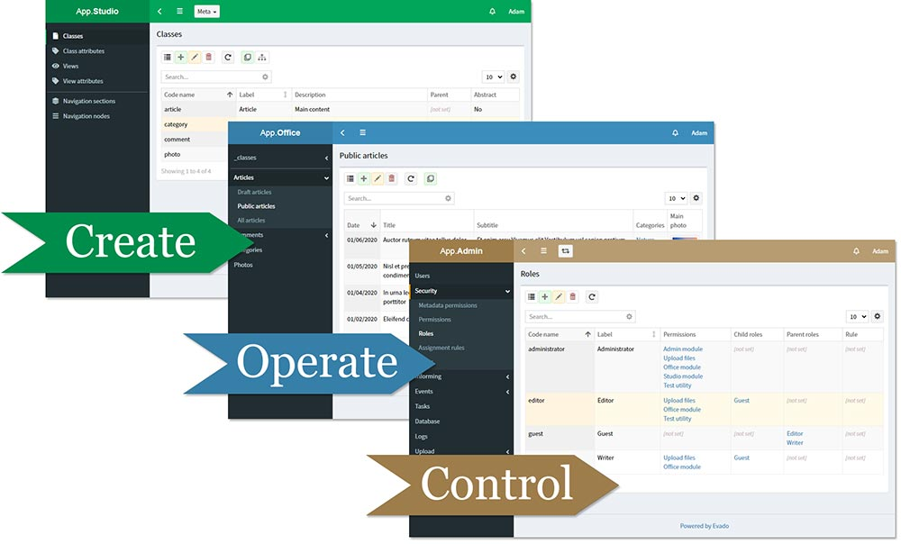

# Evado Declarative Framework

### A high-level framework for rapidly developing web apps by declaring entities and relationships through a web interface.

- Node.js and MongoDB accelerate development and simplify support.
- User-friendly design optimizes data handling and reduces errors.
- Modular structure makes it easy to customize components and create new ones.
- Strict separation of user permissions improves operational control.
- Responsive web API interacts with external systems.
- Unified web interface accelerates user skills.

### Ready to use

- [Demo App](https://github.com/mkhorin/evado-app-demo) - demonstration of the main features
- [Boilerplate App](https://github.com/mkhorin/evado-app-boilerplate) - a full-featured web app template
- [E-Champ](https://github.com/mkhorin/e-champ) - a platform for online games
- [Neural Net](https://github.com/mkhorin/neural-net) - neural networks for digit recognition

### Ready to try

Web applications built on the Evado Declarative Framework:

- [Auction](https://github.com/mkhorin/evado-app-auction)
- [Blog](https://github.com/mkhorin/evado-app-blog)
- [Bug Tracking System](https://github.com/mkhorin/evado-app-bugs)
- [Cinema Management](https://github.com/mkhorin/evado-app-cinema)
- [Distance Learning](https://github.com/mkhorin/evado-app-elearning)
- [E-government](https://github.com/mkhorin/evado-app-egov)
- [Expert System](https://github.com/mkhorin/evado-app-expert)
- [Online Shop](https://github.com/mkhorin/evado-app-shop)
- [Social Network](https://github.com/mkhorin/evado-app-social)
- [Stock Exchange](https://github.com/mkhorin/evado-app-exchange)
- [Taxi Ordering Network](https://github.com/mkhorin/evado-app-taxi)